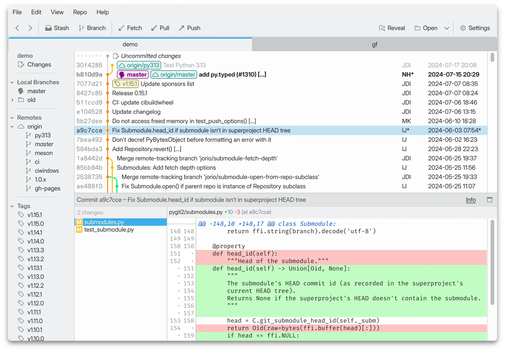

#  GitFourchette

The comfortable Git UI for Linux.

- A comfortable way to explore and understand your Git repositories
- Powerful tools to stage code, create commits, and manage branches
- Snappy and intuitive Qt UI designed to fit in snugly with KDE Plasma

Learn more on GitFourchette’s homepage at [gitfourchette.org](https://gitfourchette.org).



## Documentation

- [GitFourchette User’s Guide](https://gitfourchette.org/guide)
- [Limitations](https://gitfourchette.org/limitations.html)
- [Changelog](CHANGELOG.md)

## Install

### Prebuilt binaries (easy)

Get a prebuilt AppImage from the [releases](https://github.com/jorio/gitfourchette/releases).

### Run from source using your system’s Qt libraries (recommended)

This method gives you the best integration with your desktop environment.

1. With your system’s package manager, install *PyQt6* and *pygit2* (version 1.15.1 or later):
    <br>(Note: You can substitute PyQt6 with PySide6. GitFourchette is compatible with both.)
    <table>
    <tr><td>Ubuntu  </td><td><code>apt install python3-pygit2 python3-pyqt6</code></td></tr>
    <tr><td>Fedora  </td><td><code>dnf install python3-pygit2 python3-pyqt6</code></td></tr>
    <tr><td>Arch    </td><td><code>pacman -S python-pygit2 python-pyqt6</code></td></tr>
    </table>

2. ` git clone https://github.com/jorio/gitfourchette `

3. ` ./gitfourchette/run.sh `

<!--
### Install from source with pip

```sh
git clone https://github.com/jorio/gitfourchette
pip install -e gitfourchette[pyqt6]
```

Note: If you want to use PySide6 instead of PyQt6, you can run `pip install -e gitfourchette[pyside6]`

Then run `gitfourchette`.

Note: Installing PyQt6 or PySide6 via pip instead of your system’s package manager may cause GitFourchette to be oblivious to your desktop environment theme.
-->

## About the project

I started out writing GitFourchette in my spare time to scratch my itch for a Git UI I’d feel cozy in. After plenty of “dogfooding it” to develop my other projects, I’m finally taking the plunge and releasing it publicly—maybe it’ll become your favorite Git client too.

## Donate 🩷

GitFourchette is free—both as in beer and as in freedom. But if it helped you get work done, feel free to [buy me a coffee](https://ko-fi.com/jorio)! Any contribution will encourage the continuation of the project. Thank you!

## License

GitFourchette © 2024 Iliyas Jorio. Distributed under the terms of the [GNU General Public License v3](LICENSE).